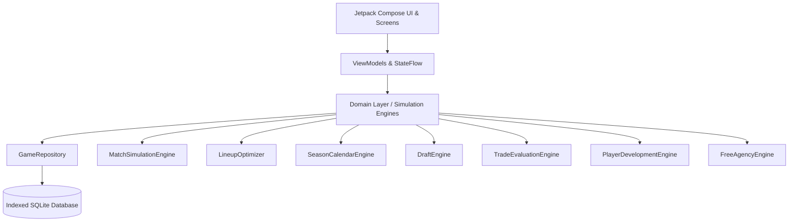

# Basket Manager Modern (Re-engineered) 🏀

A complete, modern Android reproduction of **Basket Manager 2015**, engineered from the ground up using **Kotlin**, **Jetpack Compose**, **Material Design 3**, and modern architectural patterns.

---

## 🌟 Modernization Highlights

| Feature / Aspect | Original 2015 APK | Modernized 2026 Reproduction |
| :--- | :--- | :--- |
| **Language** | Legacy Java 7 / Dalvik | **Kotlin 2.0+** (Clean Architecture & Type Safety) |
| **UI Toolkit** | Legacy XML Views & ListView / Fragments | **100% Jetpack Compose** & **Material Design 3** |
| **State & Concurrency** | Deprecated `AsyncTask` & Thread locks | **Coroutines** & **StateFlow / MVVM** |
| **Persistence** | Custom Reflection SQLite ORM | **Indexed SQLite Database & Repository Pattern** |
| **UI & Theme** | Holo / Android 5.0 Theme | **Material 3 Dynamic Theme** (Dark / Light mode) |
| **Match Engine** | Hardcoded possession loop | **High-performance simulation engine** with overtime, fatigue, injury & PER calculations |
| **Trade Machine** | Rigid dialog swaps | **Interactive Trade Machine** with real-time value and salary cap matching |
| **Draft & Market** | Fixed round increments | **Procedural scouting board**, draft lottery, and dynamic free agency bidding |
| **Localization** | Static string resources | **Full English & Chinese (Simplified/Traditional) i18n** |

---

## 🏗 Architecture Overview



### Module & Package Breakdown
```
app/src/main/java/com/basketmanager/re/
├── domain/
│   ├── model/         # Domain Entities (Player, Team, Match, MatchResult, Tactic, etc.)
│   ├── engine/        # Simulation Engines (Match, Lineup, Draft, Trade, Progression)
│   └── repository/    # GameRepository Interface
├── data/
│   ├── local/
│   │   ├── entity/    # Database Entities
│   │   └── database/  # SQLite Database Helper & Entity Mappers
│   └── repository/    # GameRepositoryImpl
├── ui/
│   ├── theme/         # Material 3 Color, Type, Theme
│   ├── components/    # Reusable Compose widgets (RatingBadge, BoxScores, DetailSheets)
│   ├── viewmodel/     # MainViewModel & GameDashboardViewModel
│   ├── screens/       # Compose Screens (Menu, Team Select, Dashboard, Roster, Lineup, Tactics, Standings, Trade, Free Agency, Draft)
│   └── navigation/    # AppNavigation (Navigation Compose)
└── BasketManagerApplication.kt
```

---

## 🎮 Key Features

1. **Franchise Hub & Dashboard**:
   - 30 NBA teams across Eastern and Western Conferences and 6 Divisions.
   - Matchday scheduler spanning regular season (82 games), playoffs, and off-season events.
   - One-click daily simulation and multi-day fast forwarding.
2. **Deep Tactical & Lineup Controls**:
   - Starting 5 & Bench 5 positional depth charts.
   - 1-Click Algorithmic Auto-Lineup optimizer.
   - Franchise Star assignments (+3, +2, +1 bonus).
   - Pace / Game Style slider (Conservative -> Aggressive).
   - Bench Rotation Depth slider (1..5) managing starter vs bench minutes and fatigue.
   - Paint scoring vs 3-point attempt sliders.
3. **Realistic Match Simulation**:
   - 120 possessions per game with realistic tempo.
   - Steals, turnovers, assists, blocks, shooting fouls, and rebound battles.
   - Overtime sudden death periods.
   - Authentic Player Efficiency Rating (PER) box scores.
4. **NBA Trade Machine**:
   - Multi-asset proposals (up to 3 players + draft picks per side).
   - Real-time market value matching and strict salary cap compliance checks.
5. **Off-Season Dynamics**:
   - 90-prospect rookie draft board with rare legendary prospects.
   - Contract extensions with player loyalty mechanics.
   - Dynamic free agency bidding market with AI team signings.
   - Player development and age-based physical regression.

---

## 🚀 Building and Running

### Prerequisites
- JDK 17+ or JDK 21
- Android SDK 35 (compileSdk 35, minSdk 24)
- Gradle 8.10+

### Build Debug APK
```bash
./gradlew assembleDebug
```

### Run Unit Tests
```bash
./gradlew test
```

---

## 📄 Accompanying Documentation
- [Phase 1: APK Decompilation & Architecture Analysis](docs/PHASE1_APK_ANALYSIS.md)
- [Phase 2: Domain Model & Simulation Engine](docs/PHASE2_DOMAIN_SIMULATION_ENGINE.md)
- [Phase 3: Persistence & State Layer](docs/PHASE3_PERSISTENCE_STATE_LAYER.md)
- [Phase 4: Modern Compose UI Implementation](docs/PHASE4_COMPOSE_UI_IMPLEMENTATION.md)
- [Comprehensive Modernization Report](docs/MODERNIZATION_REPORT.md)
